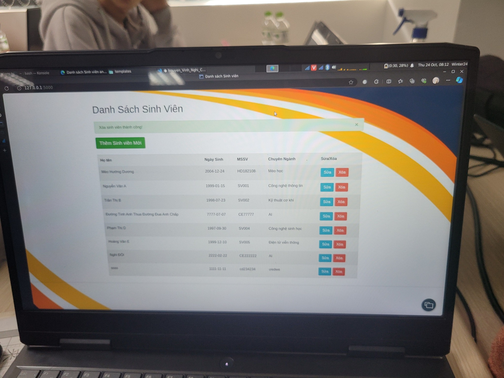

<h1>Project Title</h1>
A Flask application for managing student information.

  

<h1 align="center">=========================</h1>

<h2>Description</h2>
This project includes a Flask web application that allows for the management of student records stored in a database. 

Users can add, edit, and delete student information via a web interface. 

The project integrates Flask, IBM DB2, and Flask-WTF for form handling.
<h1 align="center">=========================</h1>

<h2>Installation</h2>
Dependencies
- Python 3.8+
- Flask
- IBM DB
- Flask-WTF
<h1 align="center">=========================</h1>

<h2>Usage</h2>
To run the application, just execute the notebook file